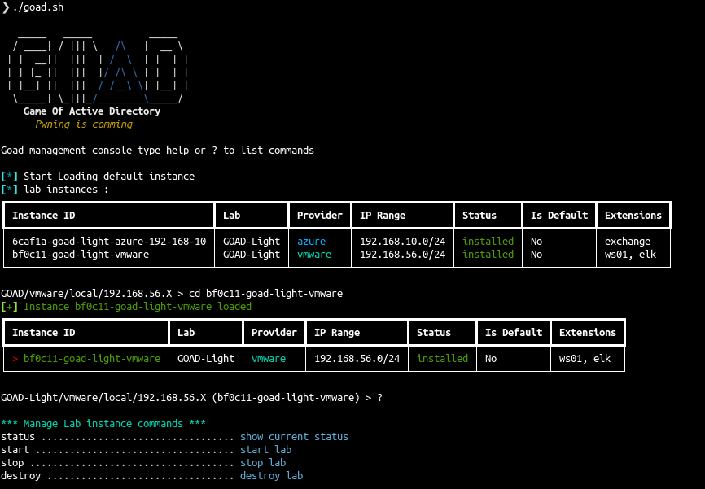
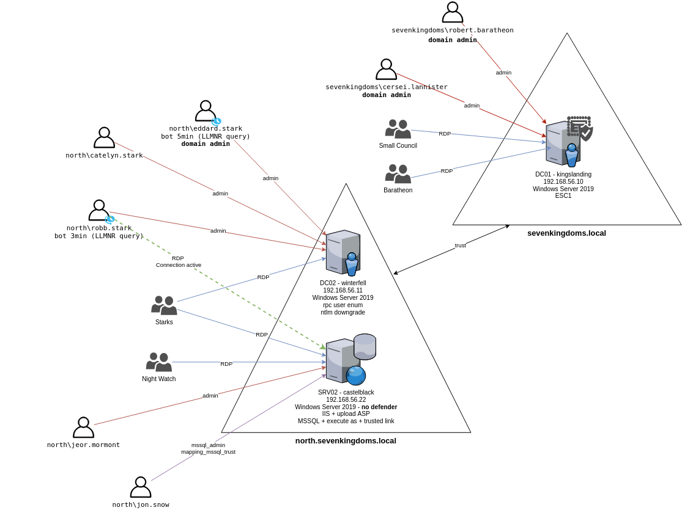
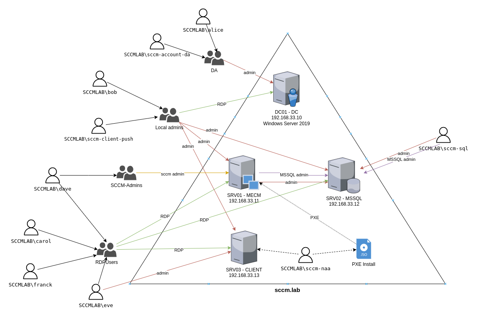

<div align="center">
  <h1></h1>
  <br>
</div>

**GOAD (v3)**

:bookmark: Documentation : [https://orange-cyberdefense.github.io/GOAD/](https://orange-cyberdefense.github.io/GOAD/)

## Description
GOAD is a pentest active directory LAB project.
The purpose of this lab is to give pentesters a vulnerable Active directory environment ready to use to practice usual attack techniques.

> [!CAUTION]
> This lab is extremely vulnerable, do not reuse recipe to build your environment and do not deploy this environment on internet without isolation (this is a recommendation, use it as your own risk).<br>
> This repository was build for pentest practice.



## Licenses
This lab use free Windows VM only (180 days). After that delay enter a license on each server or rebuild all the lab (may be it's time for an update ;))

## Available labs

- GOAD Lab family and extensions overview
<div align="center">

</div>

- [GOAD](https://orange-cyberdefense.github.io/GOAD/labs/GOAD/) : 5 vms, 2 forests, 3 domains (full goad lab)
<div align="center">

</div>

- [GOAD-Light](https://orange-cyberdefense.github.io/GOAD/labs/GOAD-Light/) : 3 vms, 1 forest, 2 domains (smaller goad lab for those with a smaller pc)
<div align="center">

</div>

- [MINILAB](https://orange-cyberdefense.github.io/GOAD/labs/MINILAB/): 2 vms, 1 forest, 1 domain (basic lab with one DC (windows server 2019) and one Workstation (windows 10))

- [SCCM](https://orange-cyberdefense.github.io/GOAD/labs/SCCM/) : 4 vms, 1 forest, 1 domain, with microsoft configuration manager installed
<div align="center">

</div>

- [NHA](https://orange-cyberdefense.github.io/GOAD/labs/NHA/) : A challenge with 5 vms and 2 domains. no schema provided, you will have to find out how break it.

## Offline Mode Support

GOAD now supports running in completely airgapped/offline environments. To enable offline mode:

1. First, run the cache dependencies script with internet access:
```bash
./scripts/cache_dependencies.sh
```

2. Verify that all required files are cached:
```bash
./scripts/check.sh
```

3. Transfer the entire GOAD directory including the `cache` folder to your airgapped environment

4. Run GOAD as normal - it will automatically detect and use the cached files

The cache contains:
- All required installers and binary files
- Python pip packages
- Ansible collections and roles
- Exchange Server installation media
- Windows updates and prerequisites

Note: When running in offline mode, make sure your DNS is properly configured in the airgapped environment since the lab still needs name resolution to function properly.
